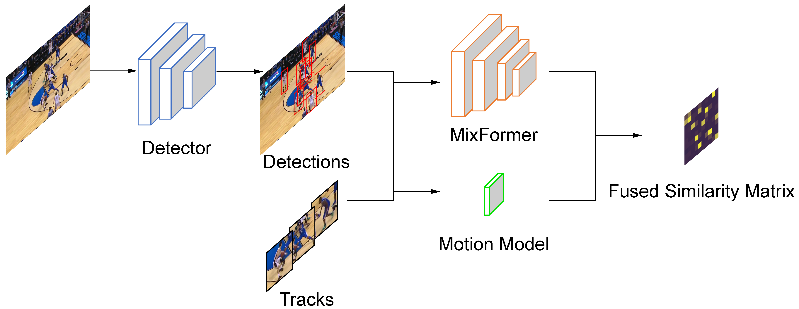

# MixSort

MixSort is the proposed baseline tracker in [**SportMOT**](https://github.com/MCG-NJU/SportsMOT). It's designed to enhance the appearance-based association performance and can be applied to any trackers that follow the tracking-by-detection paradigm, such as [ByteTrack](https://github.com/ifzhang/ByteTrack) and [OC-SORT](https://github.com/noahcao/OC_SORT).

<p align="center"></p>

## Tracking performance
### Results on MOT17 test set
| Dataset    |  HOTA↑ | IDF1↑ | AssA↑ | MOTA↑ | DetA↑  | IDs↓ |
|------------|-------|------|------|------|-------|-----|
|ByteTrack   | 63.1 | 77.3 | 62.0 | **80.3** | **64.5** | 2196 | 
|**MixSort-Byte**| **64.0** (+0.9) | **78.7** (+1.4) | **64.2** | 79.3 | 64.1  | 2235 |
|OC-SORT| 63.2 | 77.5 | 63.4 | 78.0 | 63.2  | 1950 |
|**MixSort-OC**| 63.4 (+0.2) | 77.8 (+0.3) | 63.2 | 78.9 | 63.8  | **1509** |

### Results on SportsMOT test set
| Dataset    |  HOTA↑ | IDF1↑ | AssA↑ | MOTA↑ | DetA↑  | IDs↓ |
|------------|-------|------|------|------|-------|-----|
|ByteTrack   | 64.1 | 71.4 | 52.3 | 95.9 | 78.5 | 3089 | 
|**MixSort-Byte**| 65.7 (+1.6) | 74.1 (+2.7) | 54.8 | 96.2 | 78.8  | **2472** |
|OC-SORT| 73.7 | 74.0 | 61.5 | 96.5 | 88.5  | 2728 |
|**MixSort-OC**| **74.1** (+0.4) | **74.4** (+0.4) | **62.0** | **96.5** | **88.5**  | 2781 |

### Visualization results (MixSort-Byte) on SportsMOT test set


## Installation

```shell
git clone --recursive https://github.com/MCG-NJU/MixSort
cd MixSort

conda create -n MixSort python=3.8

# choose appropriate version of torch and torchvision
# you can refer to https://pytorch.org/get-started/previous-versions/
conda install pytorch==1.12.1 torchvision==0.13.1 torchaudio==0.12.1 cudatoolkit=10.2 -c pytorch

# ByteTrack dependencies
pip3 install -r requirements.txt
python3 setup.py develop
pip3 install cython pycocotools cython_bbox

# MixFormer dependencies
sudo apt-get install libturbojpeg
pip3 install -r MixViT/requirements.txt
```

## Data preparation

Download [SportsMOT](https://github.com/MCG-NJU/SportsMOT), [MOT17](https://motchallenge.net/), [SoccerNet](https://www.soccer-net.org/), [DanceTrack](https://dancetrack.github.io/), [CrowdHuman](https://www.crowdhuman.org/), and put them under `<MixSort_HOME>/datasets` in the following structure:
```
datasets
   |——————SportsMOT
   |        └——————train
   |        └——————val
   |        └——————test
   |——————MOT17
   |        └——————train
   |        └——————test
   |——————SoccerNet
   |        └——————train
   |        └——————test
   |        └——————challenge
   |——————DanceTrack
   |        └——————train
   |        └——————val
   |        └——————test
   └——————crowdhuman
             └——————Crowdhuman_train
             └——————Crowdhuman_val
             └——————annotation_train.odgt
             └——————annotation_val.odgt
```

Then, you need to turn the datasets to COCO format and create [TrackingNet](https://tracking-net.org/) format annotation files:

```shell
cd <MixSort_HOME>
python3 tools/convert_sportsmot_to_coco.py
python3 tools/convert_mot17_to_coco.py
python3 tools/convert_soccernet_to_coco.py
python3 tools/convert_dancetrack_to_coco.py
python3 tools/convert_crowdhuman_to_coco.py
python3 tools/mix_crowdhuman.py # this will mix CrowdHuman-train and CrowdHuman-val

python3 tools/convert_sportsmot_anno.py
python3 tools/convert_mot17_anno.py
# to create TrackingNet format annotation files for SoccerNet and DanceTrack, just use the same script as SportsMOT with different paths

# run the following commands if you want to train on the mixed dataset containing SportsMOT-train and SportsMOT-val
python3 tools/mix_sportsmot.py
python3 tools/convert_sportsmot_mix_anno.py
```


## Model zoo

The trained models are provided in [[google]](https://drive.google.com/drive/folders/1pQs1gFC_jG0TlGIUMgf3E0I3OztCvgxI?usp=sharing), [[baidu (code:7438)]](https://pan.baidu.com/s/1YAP1zKtx-M_ay6uZINoCHg). For YOLOX model trained on MOT17 or DanceTrack, you can refer to [ByteTrack](https://github.com/ifzhang/ByteTrack#model-zoo) and [DanceTrack](https://github.com/DanceTrack/DanceTrack/blob/main/ByteTrack/README.md). 

After downloading the pretrained models, you can put them under `<MixSort_HOME>/pretrained`.


## Training

The COCO pretrained YOLOX model (`yolox_x.pth`) can be downloaded from their [model zoo](https://github.com/Megvii-BaseDetection/YOLOX/tree/0.1.0). 

* **Train YOLOX on CrowdHuman**

```shell
cd <MixSort_HOME>
python3 tools/train.py -f exps/example/mot/yolox_x_ch.py -d 8 -b 48 --fp16 -o -c pretrained/yolox_x.pth
```
Then you can get `yolox_x_ch.pth.tar`.

* **Train YOLOX on MOT dataset**

please replace `{dataset}` with the dataset you choose (refer to `exps/example/mot/` directory)
```shell
cd <MixSort_HOME>
python3 tools/train.py -f exps/example/mot/yolox_x_{dataset}.py -d 8 -b 48 --fp16 -o -c pretrained/yolox_x_ch.pth.tar
```

* **Train MixFormer on MOT dataset**

The pretrained MixFormer model (`MixFormerOnlineScore.pth.tar`) can be downloaded from above.

You should change `DATA.TRAIN.DATASETS_NAME` and `DATA.VAL.DATASETS_NAME` in `MixViT/experiments/mixformer_deit/baseline.yaml` to the dataset you choose (or create new one). Other training settings such as batch size and epochs could also be modified in the file. Then you can train MixFormer on MOT dataset:

```shell
cd <MixSort_HOME>

# single GPU training
python3 MixViT/lib/train/run_training.py --script mixformer_deit --config baseline --save_dir ./exp/{exp_name}

# multi-GPU training
python3 -m torch.distributed.launch --nproc_per_node=8 MixViT/lib/train/run_training.py --script mixformer_deit --config baseline --save_dir ./exp/{exp_name}
```

* **Train custom dataset**

First, you can refer to [ByteTrack](https://github.com/ifzhang/ByteTrack/tree/main#training) for training YOLOX on your custom dataset. Then, to train MixFormer on your custom dataset, you need to follow the steps below:

1. create a dataset file for your dataset in `MixViT/lib/train/dataset` (You can refer to `dancetrack.py` in the same directory)
2. add your dataset to `names2datasets` function in `MixViT/lib/train/base_function.py`
3. prepare your dataset in TrackingNet format (You can refer to `tools/convert_sportsmot_anno.py`)
4. add the paths you use to `MixViT/lib/train/admin/local.py`
5. change `DATA.TRAIN.DATASETS_NAME` and `DATA.VAL.DATASETS_NAME` in `MixViT/experiments/mixformer_deit/baseline.yaml` to your dataset (or create new one).
6. run the following command:

```shell
cd <MixSort_HOME>

# single GPU training
python3 MixViT/lib/train/run_training.py --script mixformer_deit --config baseline --save_dir ./exp/{exp_name}

# multi-GPU training
python3 -m torch.distributed.launch --nproc_per_node=8 MixViT/lib/train/run_training.py --script mixformer_deit --config baseline --save_dir ./exp/{exp_name}
```


## Tracking

* **Run MixSort (ByteTrack)**

To track on different datasets:
1. change `-f` and `-c` to the corresponding exp file and yolox checkpoint. You also need to change `MODEL.BACKBONE.PRETRAINED_PATH` in  `MixViT/experiments/mixformer_deit/track.yaml` to the MixFormer checkpoint you want to use.
2. in the exp file (i.e. `-f`), change `self.val_ann` to the right json file that you want to evaluate on.

```shell
cd <MixSort_HOME>
# track on SportsMOT
# you can set different parameters for basketball, volleyball, and football in SportsMOT for better results
python3 tools/track_mixsort.py -expn {exp_name} -f exps/example/mot/yolox_x_sportsmot.py -c pretrained/yolox_x_sports_train.pth.tar -b 1 -d 1 --config track

# use interpolation to get better results
# you need to change the paths in `tools/interpolation.py` to the right paths
python3 tools/interpolation.py
```
To get better results, you may need to carefully tune the parameters in `tools/track_mixsort.py`, including `alpha`, `iou_thresh`, `match_thresh`, etc.

* **Run MixSort (OC-SORT)**

Use above command, but change `track_mixsort.py` to `track_mixsort_oc.py`.

* **Ablation experiments (Table 6)**

For `mix + iou`, use `track_mixsort.py` with `--iou_only` option.

For `iou`, use `track_byte.py` with `--iou_only` option.

* **Evaluation**

Use [TrackEval](https://github.com/JonathonLuiten/TrackEval) for detailed evaluation.

We have integrated TrackEval as a submodule in this repo to help you evaluate the results easily. If you haven't cloned this repo with `--recursive` option, you can run the following command to get TrackEval:

```shell
cd <MixSort_HOME>
git submodule update --init --recursive
```

`TrackEval/data` has following structure:

```
data
├── gt
│   └── mot_challenge
│       └── sports-val
│       └── ... (other datasets)
│       └── seqmaps
│           └── sports-val.txt
│           └── ... (other datasets)
└── trackers
    └── mot_challenge
        ├── sports-val
        │   ├── <exp_name>
        │   │   └── data
        │   │       └── <seq_name>.txt
        │   │       └── ... (other sequences)
        │   └── ... (other exps)
        └── ... (other datasets)
```

For example, if you want to evaluate on SportsMOT validation set, you could create symbolic link as follows:

```shell
cd <MixSort_HOME>
ln -s datasets/SportsMOT/val TrackEval/data/gt/mot_challenge/sports-val
```

And then put the tracking results in `TrackEval/data/trackers/mot_challenge/sports-val/<exp_name>/data` or create a symbolic link to the tracking results. Finally, you can run the following command to evaluate the results:

```shell
cd <MixSort_HOME>
python TrackEval/scripts/run_mot_challenge.py --BENCHMARK sports --SPLIT_TO_EVAL val --TRACKERS_TO_EVAL <exp_name>
# For MOT17 validation set, you should add the following option: --GT_LOC_FORMAT '{gt_folder}/{seq}/gt/gt_val_half.txt'
```

We have also provided a python method in `TrackEval/scripts/eval_mot.py` to help you evaluate the results more conveniently. You can refer to it for more details.

## Citation

```
@article{cui2023sportsmot,
  title={SportsMOT: A Large Multi-Object Tracking Dataset in Multiple Sports Scenes},
  author={Cui, Yutao and Zeng, Chenkai and Zhao, Xiaoyu and Yang, Yichun and Wu, Gangshan and Wang, Limin},
  journal={arXiv preprint arXiv:2304.05170},
  year={2023}
}
```

## Acknowledgement

The code is mainly based on [ByteTrack](https://github.com/ifzhang/ByteTrack),  [OC-SORT](https://github.com/noahcao/OC_SORT) and [MixFormer](https://github.com/MCG-NJU/MixFormer). Thanks their wonderful works.
